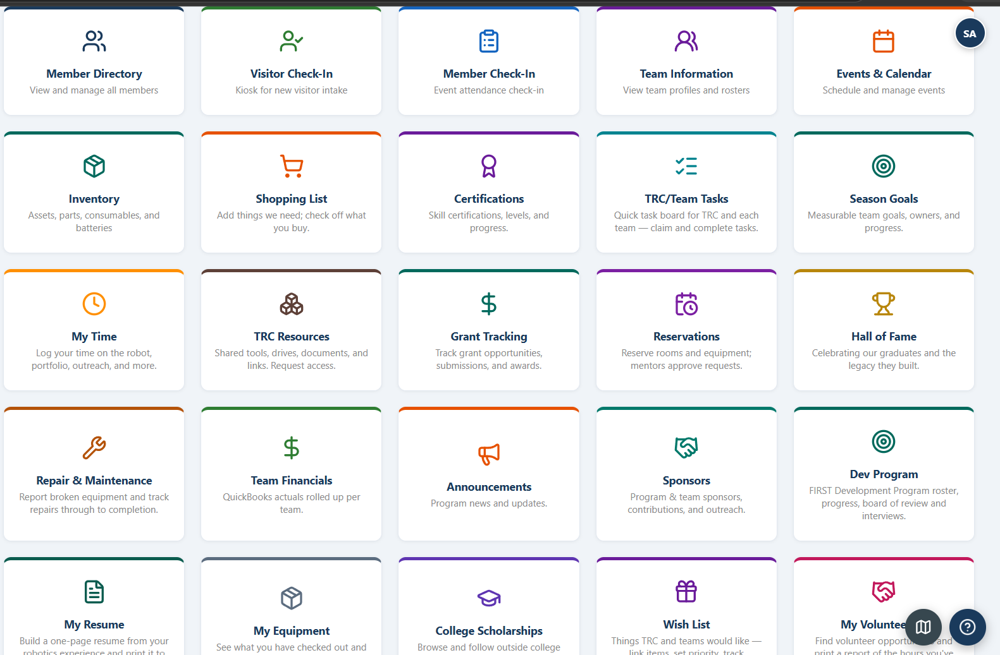
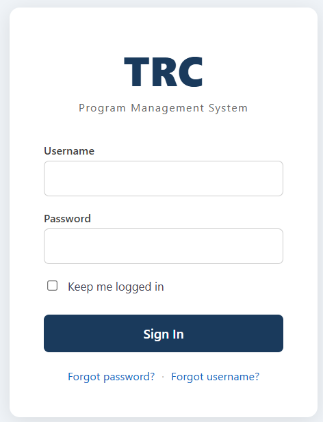
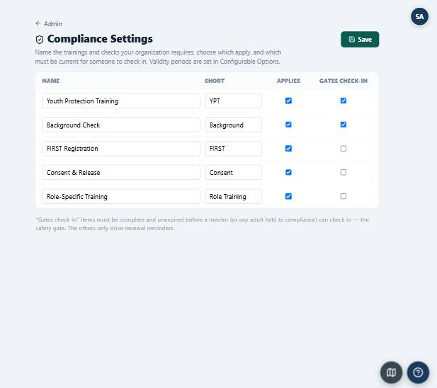
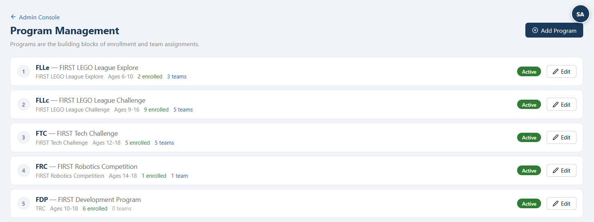

# TRCMS — Team & Program Management System

**An open-source program-management platform for FIRST robotics organizations** — and, increasingly,
any youth/STEM program. TRCMS runs the whole back office: members and families, teams and seasons,
enrollment and payments, events and logistics, communications, inventory, fundraising, time and
volunteer tracking, safety/compliance, and reporting.

Built and battle-tested in production by the [Tulsa Robotics Center](https://tulsaroboticscenter.org),
now shared so other organizations can run it too. Self-hosted, single-tenant, and free
([AGPL-3.0](LICENSE)).

> **Status:** production-ready for FIRST robotics organizations — with a guided **first-run setup
> wizard**, runtime **module enable/disable**, and configurable **branding, programs, and compliance**.
> Broader (non-robotics) generalization is ongoing.

## Screenshots

<table>
  <tr>
    <td align="center" width="50%"><br><sub>A module for every part of the back office</sub></td>
    <td align="center" width="50%"><br><sub>Sign in — your organization's branding</sub></td>
  </tr>
  <tr>
    <td align="center" width="50%"><br><sub>Configurable compliance — rename items, choose what gates check-in</sub></td>
    <td align="center" width="50%"><br><sub>Programs — FIRST out of the box, or define your own</sub></td>
  </tr>
</table>

## What it does

TRCMS is organized into modules — enable the ones your organization needs.

**Members & people**
- Member directory & profiles (youth, mentors, parents, volunteers) with families/guardians
- Role & permission management (fine-grained, permission-key based)
- Certifications & badges, youth resume builder, Hall of Fame

**Recruiting & onboarding**
- Visitor/prospect tracking & recruitment funnel with waitlists
- Online enrollment & registration (Terms & Conditions, waivers, media release, medical/consent)
- Member & visitor **check-in** (self-service, kiosk stations, and an FLL attendance kiosk)
- Summer camp registration & management

**Teams & season**
- Teams & rosters, per-season history
- Season planning (drag-and-drop), season goals & strategy/portfolio
- Team tasks & planning, issue logs, meeting minutes
- FIRST Development Program (FDP) roster, progress & interviews

**Events & logistics**
- Events & calendar with RSVPs, transportation/rides, and printable logistics
- Room/resource reservations

**Communications**
- Bulk & targeted email with templates, merge fields, and attachments
- Announcements, in-app feedback/ticketing

**Finance & fundraising**
- Enrollment fees & invoicing, online **payments (Square + PayPal)**, payment plans, scholarships
- Team budgets/BOMs, purchase orders, grants, sponsors, wish lists, raffles

**Inventory & equipment**
- Inventory & asset tracking, shopping lists, equipment checkout, repair/maintenance tickets, resources

**Time, safety & reporting**
- Time & activity logging, volunteer-hours tracking
- **Compliance** tracking (YPT / background checks) with automated renewal reminders
- **Incident reports** with an anonymous, sealed-vault option
- A reporting suite (rosters, enrollment/payment status, attendance, activity impact, and more), plus an admin console, help center, and usage analytics

## Tech stack
- **Backend:** PHP 8.x (Slim 4) + MySQL / MariaDB
- **Frontend:** React + TypeScript + Vite
- **Auth:** stateless JWT (HS256) with server-side revocation
- No card data touches the app — payments use the provider's hosted checkout

## Requirements
- PHP **8.x** with `pdo_mysql`, `openssl`, `mbstring`, `dom` extensions
- MySQL 8+ or MariaDB 10.4+
- A web server that can serve a PHP front controller (Apache/nginx), **document root set to `public/`**
- HTTPS
- For building the frontend from source: Node 18+ / npm

## Quick start (self-host)
> A guided installer is coming (see roadmap). Until then:

1. **Get the code** — clone the repo (or download a release tarball, which bundles dependencies and
   a pre-built frontend so you can skip the build steps).
2. **Install dependencies** (if building from source): `composer install` and, in the frontend,
   `npm install && npm run build`.
3. **Configure** — copy `.env.example` to `.env` (kept **outside** the web root) and fill in your
   database, site URL, and a freshly generated secret:
   ```
   SECRET_KEY=$(php -r "echo bin2hex(random_bytes(32));")
   ```
   Each install must use its **own** `SECRET_KEY` and `INCIDENT_VAULT_KEY` — never reuse another
   install's.
4. **Create the database** and run the migrations: `php deploy/migrate.php`.
5. **Point the web root at `public/`** (never the repository root).
6. **Create your first administrator** and sign in.
7. **Set up cron jobs** for reminders/notifications (payment, compliance, etc.) — see the deploy docs.

See `PLESK_DEPLOYMENT.md` and `SETUP_WINDOWS.md` for detailed, host-specific instructions.

## Configuration
Most settings are managed in-app under **Admin** once you're running: organization name & branding,
email (SMTP), payment providers, notification addresses, roles & permissions, compliance policy,
enrollment/consent text, and email templates. Secrets live in `.env`.

## Security
TRCMS handles data about minors. Please read [SECURITY.md](SECURITY.md) for the operator hardening
checklist and how to report a vulnerability **privately** (never a public issue).

## Contributing
Contributions are welcome — see [CONTRIBUTING.md](CONTRIBUTING.md). Open an issue to discuss
non-trivial changes first.

## License
[GNU AGPL-3.0](LICENSE). If you run a modified version as a network service, you must make your
source available. Built with ❤️ for the volunteers who make robotics programs happen.
